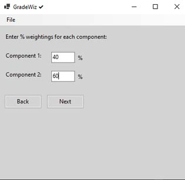
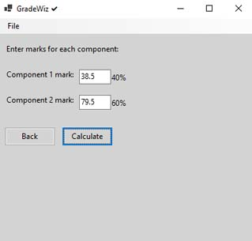
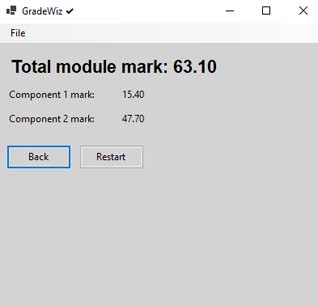

# GradeWiz ✔ (C# Version / Win)

Welcome to GradeWiz! 🎓✨

GradeWiz is a simple and intuitive C# application for Windows that compiles as an executable. Designed to help students calculate their module grades based on component weightings and scores. Whether you're managing your coursework, projects, or exams, GradeWiz provides an easy way to determine your overall module mark.

<table>
  <tr>
    <td></td>
    <td></td>
  </tr>
  <tr>
    <td></td>
    <td></td>
  </tr>
</table>

## 🚀 Features

✔ **User-Friendly Interface**: A sleek panel-based graphical user interface with a modern look and feel.  
✔ **Component Weightings**: Input percentage weightings for up to 5 components and ensure they add up to 100%.  
✔ **Score Entry**: Enter scores for each component to calculate your final module mark.  
✔ **Results Summary**: View a detailed breakdown of your component marks and the final calculated grade.  
✔ **Reset and Restart Options**: Easily reset the application or restart the process to calculate new grades.  

## 📋 How to Use

1. **Start the Application**: Launch the GradeWiz application and you will be greeted with the main menu.
2. **Enter the Number of Components**: Input the number of components for which you need to calculate grades (1 to 5).
3. **Input Weightings**: Enter the percentage weightings for each component, ensuring the total sums to 100%.
4. **Enter Scores**: Provide the scores you achieved for each component.
5. **View Results**: Calculate your final module mark and see a detailed breakdown of how each component contributed to your final grade.
6. **Reset or Restart**: Use the options in the menu to start over or adjust your inputs.

## 💻 Installation

If pulling the codebase, to run GradeWiz, you need to have Microsoft .NET Windows Runtime 8.0.303 (x64) or higher installed. It is recommended to use Visual Studio Code. Follow these steps to get started:

1. **Clone the Repository**:
    ```bash
    git clone https://github.com/TechAngelX/GradeWiz-C-Sharp-WinVersion.git
    ```
2. **Navigate to the Project Directory**:
    ```bash
    cd GradeWiz-C-Sharp-WinVersion
    ```
3. **Compile the Code**:
    ```bash
    msbuild GradeWiz.sln
    ```
4. **Run the Application**:
    ```bash
    dotnet run
    ```

## 🛠️ Technologies Used

- **C#**: For building the desktop application.
- **Windows Forms**: GUI toolkit used for creating the graphical interface.

## 🤝 Contributing

We welcome contributions from the community! If you have suggestions for improvements or new features, feel free to open an issue or submit a pull request.

## 📄 License

Licensed under the GNU General Public License v3.0

## 🧑‍💻 Author

**Ricki Angel**  
Creator of GradeWiz ✔[LinkedIn](https://www.linkedin.com/in/ricki-angel/) | [GitHub](https://github.com/TechAngelX)


## Note
This is a basic demonstration project and provided 'as is. For production use, consider additional security measures.

If you enjoyed this project and found it useful, please feel free to leave a Bitcoin donation and buy us a coffee:

<div style="text-align: center;">
    
    <p style="font-size: 18px;">Support us with Bitcoin</p>
    <p><strong>BTC:<strong> bc1ql63v3wnn0wjw824m9r4peeajm7ynhzt2wqdmhc</Strong></p>
&copy; Ricki Angel 2024

</div>
